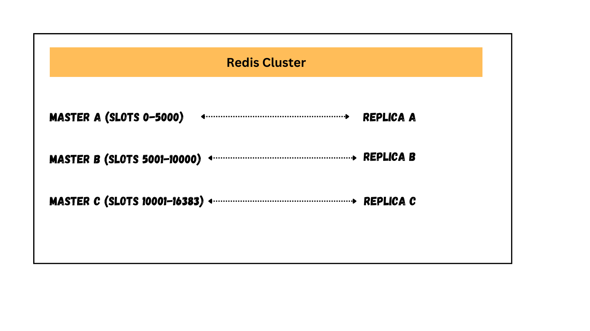
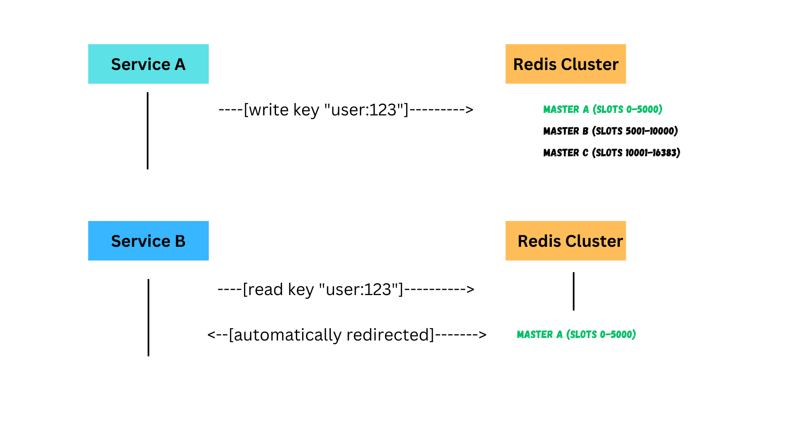
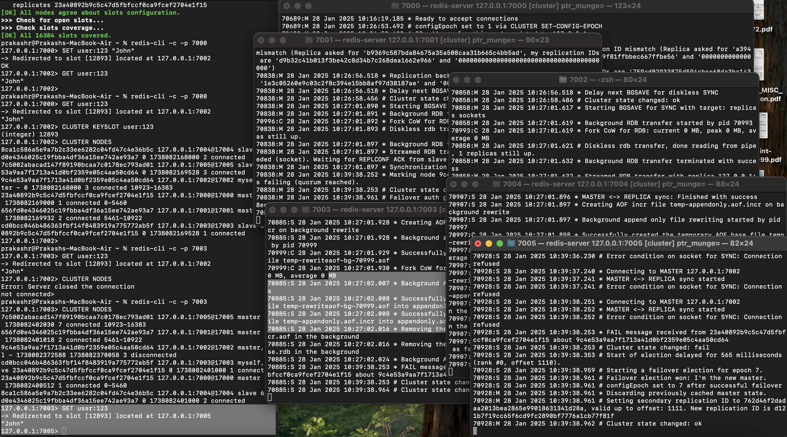

## Part -1 : Can Your Caching Mechanism Auto-Recover?

While designing scalable systems for production-grade enterprise applications, we must pick tools and stack that has resiliency built into it. 

While the shiny new tools may promise a lot of features, it’s the battle tested, reliable and one might say not-so-cool tools that would save the bad days. 

In this article, we will pick one such tool that’s almost a go-to option when it comes to implementing caching mechanisms in distributed systems. Redis is not a new kid on the block, it’s been around since 2009 and has proved its potential in scalable enterprise applications. 

So, in this article, we will not be covering topics such as: 
1. What is Redis? 
2. How is data persisted in Redis? 
3. Why is it suitable for caching and so on… 

I would recommend one of my favorite articles on all those topics in the “To Read” section at the bottom of this article. 

In this article, we will focus on one thing — Redis Cluster. 

Whether our application is a monolith or follows a microservice architecture, we would need to rely on a caching mechanism that is reliable and scalable (setting the least expectation). 
This is where Redis Cluster Management comes into the picture. 

## Redis Cluster Management — How it Works? 

Redis Cluster is a way to distribute data across multiple Redis nodes(against a single node that is ). In this mode, we would create a bunch of Redis standalone instances and then, using all these nodes, create a cluster. 

For example, in a six node scenario, three nodes would become master nodes and three nodes would become replicas. These master and replica nodes are auto assigned by Redis cluster once we provide the network address of the standalone instances.  



Let’s say we have two services — Service A and Service B. In a multi node system, if Service A writes a key to Redis and Service B tries to get the key from the Redis, how will the request go to the same node? 

This is how it works internally: 
→ Redis uses a hash slot system (16384 slots) 
→ Each key is assigned to a slot using CRC16(key) mod 16384 
→ Each master node is assigned a range of these slots 
→ The cluster automatically knows which node owns which slots 



We can verify this behavior using redis-cli. Let’s connect to one redis instance running at port 7000 ( assume we have 6 instances running on ports 7000 to 7005) 
```
redis-cli -c -p 7000 127.0.0.1:7000> SET user:123 "John" 
```
The above command will automatically redirect to the appropriate master node 
```
-> Redirected to slot \[12893\] located at 127.0.0.1:7002 OK 
```
Next, we can run the GET key command and verify the stored data, 
```
127.0.0.1:7002> GET user:123 "John"
```
As mentioned before, each key is assigned a slot in Redis node, this slot can be verified in redis-cli by passing the key to “CLUSTER KEYSLOT” command; 
```
CLUSTER KEYSLOT user:123 (integer) 12893 
```
We can also verify the slot range assigned to each master node using redis-cli. Alternatively, this information will be already available with us while creating the redis nodes (we will see that in next section). If you are curious, you could login to a slave node and try to fetch a key, you would be redirected to the appropriate master. 
```
redis-cli -c -p 7003 127.0.0.1:7003> GET user:123 -> Redirected to slot \[12893\] located at 127.0.0.1:7002 "John" 
```
*Feel free to skip next section if you are not interested in creating Redis Nodes.* 
## How to Create Redis Nodes 
Create separate directories for each node and create a “.conf” file under each one. Copy the content given below and change the port number accordingly for each file. Start the redis instances in separate windows and then we are good to create a cluster. 
Follow the commands given below if you are creating a cluster in your local. 
```
# make directories mkdir 7000 7001 7002 7003 7004 7005 # create redis.conf file under each directory,copy-paste content given below # and update the port number accordingly port 7000 cluster-enabled yes cluster-config-file nodes.conf cluster-node-timeout 5000 appendonly yes bind 127.0.0.1 daemonize no # start each redis instance using this command redis-server ./redis.conf # create cluster once all instances are up redis-cli --cluster create 127.0.0.1:7000 127.0.0.1:7001 127.0.0.1:7002 \\ 127.0.0.1:7003 127.0.0.1:7004 127.0.0.1:7005 \\ --cluster-replicas 1 
```
Once the cluster is created, the output logs would show which instances are master-slave and what slots are assigned to each master node. 
```
Master\[0\] -> Slots 0 - 5460 Master\[1\] -> Slots 5461 - 10922 Master\[2\] -> Slots 10923 - 16383 Adding replica 127.0.0.1:7004 to 127.0.0.1:7000 Adding replica 127.0.0.1:7005 to 127.0.0.1:7001 Adding replica 127.0.0.1:7003 to 127.0.0.1:7002 
```


## Auto Recovery 
In this section, let’s figure out what happens when one of the master nodes goes down. Let’s first check the cluster node info — CLUSTER NODES is the command to get cluster information. 
```
CLUSTER NODES 8ca1c586a5e9a7b2c33ee6282c04fd47c4e36b5c 127.0.0.1:7004@17004 slave 656fd0e4346025c19fbba4df36a15ee742ae93a7 0 1738082168000 2 connected 7c5002abacad147f89190bcaa7c0178ec793ad01 127.0.0.1:7005@17005 slave 9c4e53a9aa7f1713a41d0bf2359e05c4aa50cd64 0 1738082169528 3 connected 9c4e53a9aa7f1713a41d0bf2359e05c4aa50cd64 127.0.0.1:7002@17002 myself,master - 0 1738082168000 3 connected 10923-16383 23a40892b9c5c47d5fbfccf0ca9fcef2704e1f15 127.0.0.1:7000@17000 master - 0 1738082169000 1 connected 0-5460 656fd0e4346025c19fbba4df36a15ee742ae93a7 127.0.0.1:7001@17001 master - 0 1738082169932 2 connected 5461-10922 cd0bcc046b486363fbf14f8483919a775772ab5f 127.0.0.1:7003@17003 slave 23a40892b9c5c47d5fbfccf0ca9fcef2704e1f15 0 1738082169528 1 connected 
```
Next, go to one of the cmd prompts where Redis instance is running on port 7002. Shutdown that node. 

Check the cluster info once again and we see that one of the slave (port 7005) has now become the new master. 
```
127.0.0.1:7003> CLUSTER NODES 7c5002abacad147f89190bcaa7c0178ec793ad01 127.0.0.1:7005@17005 master - 0 1738082402030 7 connected 10923-16383 656fd0e4346025c19fbba4df36a15ee742ae93a7 127.0.0.1:7001@17001 master - 0 1738082401018 2 connected 5461-10922 9c4e53a9aa7f1713a41d0bf2359e05c4aa50cd64 127.0.0.1:7002@17002 master,fail - 1738082372588 1738082370058 3 disconnected cd0bcc046b486363fbf14f8483919a775772ab5f 127.0.0.1:7003@17003 myself,slave 23a40892b9c5c47d5fbfccf0ca9fcef2704e1f15 0 1738082401000 1 connected 23a40892b9c5c47d5fbfccf0ca9fcef2704e1f15 127.0.0.1:7000@17000 master - 0 1738082400512 1 connected 0-5460 8ca1c586a5e9a7b2c33ee6282c04fd47c4e36b5c 127.0.0.1:7004@17004 slave 656fd0e4346025c19fbba4df36a15ee742ae93a7 0 1738082401000 2 connected 
```
Now, if we try to retrieve the key that was previously added in port 7002 node, we will be auto-redirected to port 7005, where the key is now located. 
```
127.0.0.1:7003> GET user:123 -> Redirected to slot \[12893\] located at 127.0.0.1:7005 "John" 127.0.0.1:7005> 
```
This is how auto-recovery is handled by redis cluster. 

## Integrating with Spring Boot Application 
In SpringBoot application, integrating with redis clusters in a straightforward process. 

Firstly, we would list the nodes in yaml file. 

Secondly we need to add implementation of CacheManager and pass an instance of RedisConnectionFactory. 

Next, we could add a dummy data and persist in Cache and make a GET call to read it from cache. 
One of the below two scenarios will take place when we do a GET call: 
1. Cache Miss If a requested key is not found application’s memory, it would be looked for in Redis server. 
2. Cache Hit With Setups like @Cacheable in Spring Boot, if the data is already cached in the application layer (e.g., in the JVM's memory or a local cache), no command is sent to Redis. 

While making these API calls, we can monitor the logs in redis-cli using command — “MONITOR” 
```
127.0.0.1:7001> MONITOR OK 1738088707.389942 \[0 127.0.0.1:53657\] "HELLO" "3" 1738088707.401972 \[0 127.0.0.1:53657\] "CLIENT" "SETNAME" "lettuce#ClusterTopologyRefresh" 1738088707.404077 \[0 127.0.0.1:53657\] "CLUSTER" "NODES" 1738088707.404586 \[0 127.0.0.1:53657\] "INFO" 1738088757.197069 \[0 127.0.0.1:53670\] "HELLO" "3" 1738088757.198312 \[0 127.0.0.1:53670\] "GET" "users::123" 
```
In case of a miss, as we see in the logs above, key-123 is not available in application’s memory(@Cacheable) so a call was made to Redis Server. 

If a cache hit occurs, no actual Redis command is executed because the application retrieves the data directly from the cache layer, not from Redis itself. 

**Spring Boot Logs** 
```
2025-01-28T12:25:07.213-06:00 INFO 75267 --- \[nio-8080-exec-2\] c.r.tutorial.redis.service.UserService : Saving user to DB: User\[id=1234, name=Sample, email=xx@yy.com\] 2025-01-28T12:25:57.198-06:00 INFO 75267 --- \[nio-8080-exec-4\] c.r.tutorial.redis.service.UserService : Fetching user from DB: 123 
```
POST Curl 
```
curl --location 'http://localhost:8080/api/users' \\ --header 'Content-Type: application/json' \\ --data-raw '{ "id": "1234", "name":"Sample", "email":"xx@yy.com" }' 
```
GET Curl 
```
curl --location 'http://localhost:8080/api/users/1234' 
```


# Part 2 - Gracefully Handle Redis Node Failures in SpringBoot Applications

In a typical real-life scenario, this is a task performed by “Ops” team at their own scheduled time and convenience and they end up writing a SOP on confluence or a similar tool for other members of their team to access.

Let’s assume this task was performed and the Ops team was happy with redis-cluster ability.

When the nodes go down in real-time, Ops team would be notified by the monitoring teams/systems or support team who are all of a sudden seeing a spike in customer complaints.

Ops team would quickly analyze the situation, see that a node went down and that a new master was picked by redis-cluster but somehow application crashes as it cannot establish a connection with the master that went down.

Without a second thought, all the impacted services will be restarted and all is well again.

Developers would assume it was “Ops” team that messed up by not setting up the cluster well. Leadership will listen to the same narrative. Chances are Redis will be replaced by a new tool with bigger promises.

What should have been done?

“Dev” and “Ops” should have worked together as “DevOps” and tested failover and recovery together and figured out how to configure application in such a way that it could harness the full capabilities of the underlying system like Redis.

If you followed Part-1 (which I hope you did else none of the stuff we are discussing here would make sense), you would remember how we connected the Redis Cluster to a SpringBoot Application.

In that setup, if we were to bring a slave node down and switch to our application’s console, we would notice nothing.

The API calls would work as expected and console would be clean.

Now, what if we bring down a master node instead?

Our application will immediately start complaining about a node being down and all API calls will fail.

```
Connection refused: /127.0.0.1:7002  
2025-01-30T10:52:50.714-06:00  INFO 90224 --- [xecutorLoop-1-1] i.l.core.protocol.ConnectionWatchdog     : Reconnecting, last destination was 127.0.0.1/<unresolved>:7002  
2025-01-30T10:52:50.717-06:00  WARN 90224 --- [ioEventLoop-6-3] i.l.core.protocol.ConnectionWatchdog     : Cannot reconnect to [127.0.0.1/<unresolved>:7002]: Connection refused: /127.0.0.1:7002  
2025-01-30T10:52:59.013-06:00  INFO 90224 --- [xecutorLoop-1-2] i.l.core.protocol.ConnectionWatchdog     : Reconnecting, last destination was 127.0.0.1/<unresolved>:7002  
2025-01-30T10:52:59.018-06:00  WARN 90224 --- [ioEventLoop-6-4] i.l.core.protocol.ConnectionWatchdog     : Cannot reconnect to [127.0.0.1/<unresolved>:7002]: Connection refused: /127.0.0.1:7002  
2025-01-30T10:53:15.416-06:00  INFO 90224 --- [xecutorLoop-1-3] i.l.core.protocol.ConnectionWatchdog     : Reconnecting, last destination was 127.0.0.1/<unresolved>:7002  
2025-01-30T10:53:15.420-06:00  WARN 90224 --- [ioEventLoop-6-5] i.l.core.protocol.ConnectionWatchdog     : Cannot reconnect to [127.0.0.1/<unresolved>:7002]: Connection refused: /127.0.0.1:7002  
2025-01-30T10:53:15.422-06:00  WARN 90224 --- [ioEventLoop-6-8] i.l.c.c.t.DefaultClusterTopologyRefresh  : Unable to connect to [127.0.0.1/<unresolved>:7002]: Connection refused: /127.0.0.1:7002
```

**Experiment 1: Enable Adaptive Cluster Refresh**

We can set the adaptive refresh properties in Lettuce Redis Client and instead of providing all six ip addresses of Redis nodes just provide one.

Idea is, Lettuce would auto-discover the nodes that are part of the cluster and this way when master node goes down, we would not have to restart the server.

```
@Bean  
public RedisConnectionFactory redisConnectionFactory() {  
        RedisClusterConfiguration clusterConfiguration = new RedisClusterConfiguration(List.of(singleNode));  
        ClusterTopologyRefreshOptions topologyRefreshOptions = ClusterTopologyRefreshOptions.builder()  
                .enableAdaptiveRefreshTrigger(ClusterTopologyRefreshOptions.RefreshTrigger.MOVED_REDIRECT,  
                        ClusterTopologyRefreshOptions.RefreshTrigger.PERSISTENT_RECONNECTS)  
                .enableAllAdaptiveRefreshTriggers()  
                .adaptiveRefreshTriggersTimeout(Duration.ofSeconds(30))  
                .build();  
  
        LettuceClientConfiguration clientConfig = LettuceClientConfiguration.builder()  
                .clientOptions(ClusterClientOptions.builder()  
                        .topologyRefreshOptions(topologyRefreshOptions)  
                        .build())  
                .build();  
        return new LettuceConnectionFactory(clusterConfiguration, clientConfig);  
}
```

What worked: Providing just a single node ip instead of all six was enough to establish the connection with redis cluster.

What didn’t work: When master node goes down, application tries to re-establish the connection until it's exhausted and API calls fail.

**Experiment 2: Update config to automatically reconnect with cluster topology changes**

```
@Bean  
public RedisConnectionFactory redisConnectionFactory() {  
                RedisClusterConfiguration clusterConfiguration = new RedisClusterConfiguration(List.of(singleNode));  
  
                ClusterTopologyRefreshOptions topologyRefreshOptions = ClusterTopologyRefreshOptions.builder()  
                                .enableAdaptiveRefreshTrigger(  
                                                ClusterTopologyRefreshOptions.RefreshTrigger.MOVED_REDIRECT,  
                                                ClusterTopologyRefreshOptions.RefreshTrigger.PERSISTENT_RECONNECTS)  
                                .enableAllAdaptiveRefreshTriggers()  
                                .adaptiveRefreshTriggersTimeout(Duration.ofSeconds(30))  
                                .build();  
  
                ClusterClientOptions clientOptions = ClusterClientOptions.builder()  
                                .maxRedirects(3)   
                                .autoReconnect(true)  
                                .validateClusterNodeMembership(false)   
                                .topologyRefreshOptions(topologyRefreshOptions)  
                                .build();  
  
                LettuceClientConfiguration clientConfig = LettuceClientConfiguration.builder()  
                                .clientOptions(clientOptions)  
                                .commandTimeout(Duration.ofSeconds(5))  
                                .build();  
                return new LettuceConnectionFactory(clusterConfiguration, clientConfig);  
}
```

What Worked: Even though the system warns about a node being down,

```
2025-01-30T11:05:38.510-06:00  WARN 90931 --- [ioEventLoop-6-3] i.l.core.protocol.ConnectionWatchdog     : Cannot reconnect to [127.0.0.1/<unresolved>:7000]: Connection refused: /127.0.0.1:7000
```
it establishes a connection with the cluster. It’s possible that during the refresh, API calls would fail but the failure gets auto-recovered and topology changes reflect in the application without a server restart.

At this point, all seems to be good in the “DevOps” world.

We can achieve a few things with these kinds of approach:

1.  Establish a better work culture between engineering teams
2.  Bringdown the app downtime close to 0
3.  Harness the full capacity of a time-tested tool before chasing shiny new objects
4.  Build a reliable, highly available system in the process

## Github 

If you would like to take a look at the sample code, checkout the project here — https://github.com/r7b7/scalable-system-design 

## TO READ 
If you have time, I would highly recommend reading this article on how an in-memory db works. https://medium.com/@denisanikin/what-an-in-memory-database-is-and-how-it-persists-data-efficiently-f43868cff4c1