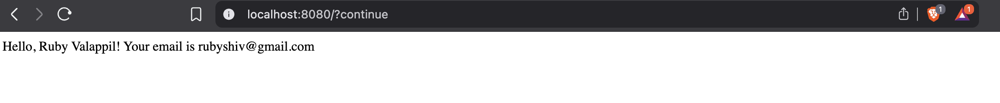
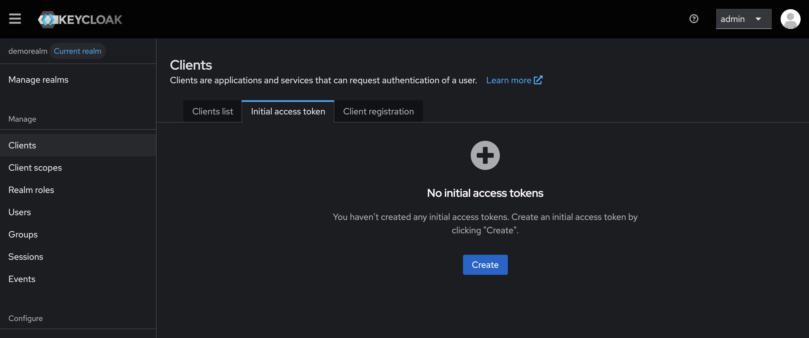
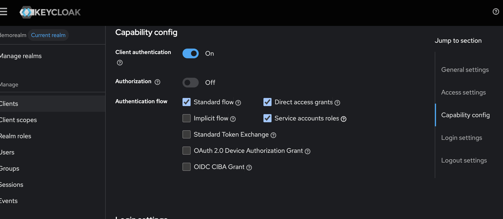
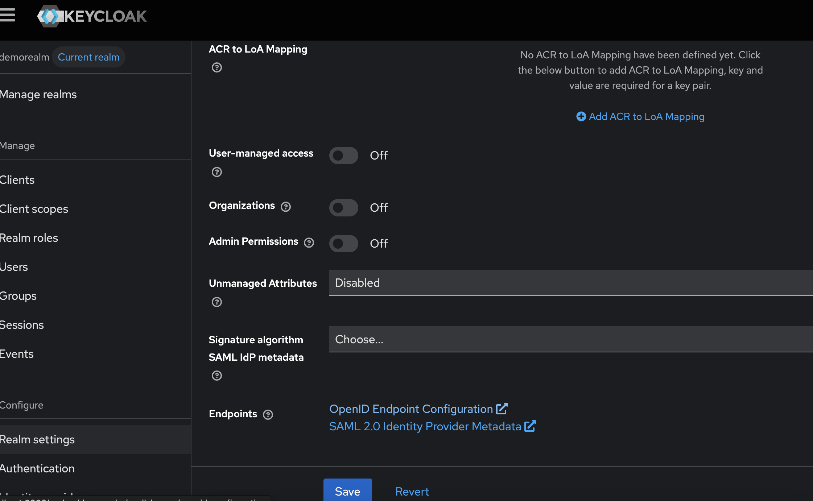
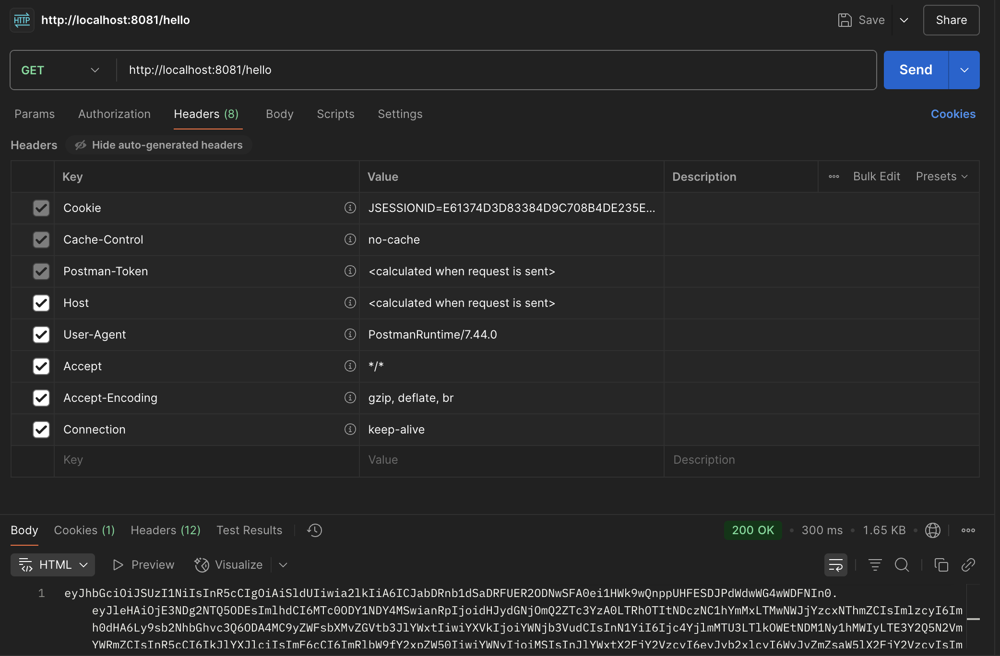
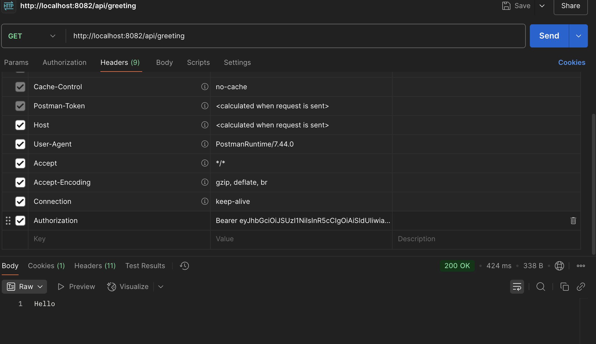

## What is OAuth?

OAuth (Open Authorization) is an authorization protocol that allows third-party applications to access a user’s resources without sharing the user's credentials or identity.

It lets users grant limited access to their data on one site (e.g. Google) to another site (e.g. StackOverflow) without giving away their username and password.

First version introduced was OAuth 1.0 and the latest improved version is OAuth 2.0.

Concept in Simple Terms:

Everytime we try to login to a new site using an existing FB or google account, OAuth works under the hood to make this possible. What that means is - when we try to access a site like StackOverflow and are asked to login using an existing Google account, we click on a button and are redirected to Google account, where we are then asked to click on an allow button - this is the process of authorizing Google to share a limited set of information with StackOverflow.


Terminologies:

-> A few fundamental concepts in OAuth are discussed in this section - this would help us in mapping different actors involved in the authorization process.

1. Resource Owner : Owner of the Resource (Data of this person/resource is shared with third party). eg: Person with a Google Account.
2. Client: One who wants access on behalf of RO. e.g: StackOverflow
3. Authentication Server: Server that provides auth tokens. e.g: Google
4. Resource Server: API/Resource that client wants access to, is stored here. e.g: Again, Google.

Same actor can play multiple roles based on the situation.

-> Authorization Grant Types (Flows) are as listed below:

| Grant Type                                           | Use Case                                                 |
| ---------------------------------------------------- | -------------------------------------------------------- |
| Authorization Code                               | Web/mobile apps with user login                          |
| Implicit (deprecated)                            | Was used for browser-based apps (no longer recommended)  |
| Client Credentials                               | Machine-to-machine/server-to-server access               |
| Resource Owner Password Credentials (deprecated) | Username/password directly given to client (discouraged) |
| Device Code                                      | Devices without browsers (TVs, consoles)                 |

-> Two types of tokens are :
1. Access Token
2. Refresh Token

-> Different endpoints are:
1. /authorize – where the user grants access (for code flow)
2. /token – where tokens are issued
3. /revoke – (optional) to revoke tokens

## What is OpenID?

We often hear the terms - OAuth and OpenID together and there is a reason for that. Together they provide a complete solution to Authentication/Authorization challenges.

OpenID Connect is a layer on top of OAuth2 that adds authentication — so apps can know who we are. It’s like OAuth2 + ID card.

## Role of OpenID and OAuth2 in Securing Apps


TBA (Apigee doesn't act as a OIDC provifer it supports providers like KeyCloak, Auth0 etc.)

## Providers that support OIDC + OAuth2

1. Okta
2. Keycloak
3. Azure AD
4. Ping Identity
5. Github - GitHub supports OAuth2 only, but it has some custom APIs that can give you user identity. So people use it for login, but it’s not standards-compliant OpenID Connect.It's like a workaround.
6. Google
7. Auth0


## In-house OAuth2/OIDC server

If you decide to build your own OAuth2 server:

It must support OpenID Connect (OIDC) if you want identity (not just tokens).

It needs to expose:

.well-known/openid-configuration

Token endpoint

Authorization endpoint

Public keys endpoint (for verifying ID tokens)

Spring Boot will use that metadata to handle the rest.

## Sample Use Cases
To understand the concepts better, we will cover a few use cases and verify the implementation using SpringBoot and Java.

Use Case 1: Service is registered as a Client with google (Auth Server and Resource Server are same - Google)
Use Case 2: Enhance Use Case 1 to add a default route post verification
Use Case 3: Service A accesses Service B securily using KeyCloak(Client and Resource Owner are Same)
Use Case 4: Service A accesses Service B securily, Service B has allows only a specific set of scopes
Use Case 5: Use TCP Authentication


**Use Case 1:**

Step 1:
To Add Google as Authentication Server and Resource Server, we would need to first create a google cloud project with OAuth2 credentials.

Follow the steps at https://console.cloud.google.com/apis/credentials to create free OAuth2 credentials.
Add sample data in all the fields, for redirect URL - add the following value - http://localhost:8080/login/oauth2/code/google. This is the default redirect URI template provided by Spring App. Note that the final path "google" in the above URL should match the registration id mentioned in application.yml file.(Refer Step 3)

Step 2:
Create a SpringBoot project from [spring](https://start.spring.io/). Add Spring Web, Spring Security and OAuth2 Client as dependency.

Alternatively, add the following dependencies to SpringBoot web project.
```
        <dependency>
			<groupId>org.springframework.boot</groupId>
			<artifactId>spring-boot-starter-oauth2-client</artifactId>
		</dependency>
		<dependency>
			<groupId>org.springframework.boot</groupId>
			<artifactId>spring-boot-starter-security</artifactId>
		</dependency>
```

Step 3:
Add following properties to application.yml file
```
spring:
  security:
    oauth2:
      client:
        registration:
          google:
            client-id: <YOUR_CLIENT_ID>
            client-secret: <YOUR_CLIENT_SECRET>
            scope:
              - openid
              - profile
              - email
        provider:
          google:
            issuer-uri: https://accounts.google.com
```

Step 4: 
Add a default GET endpoint
```
    @GetMapping("/")
    public String home(@AuthenticationPrincipal OidcUser user) {
        return "Hello, " + user.getFullName() + "! Your email is " + user.getEmail();
    }
```

Step 5:
Hit the endpoint - http://localhost:8080



In this use case, Google acts as both Authorization Server and Resource Server.


| Role                     | Definition                                                       | In Our Example                         |
| ------------------------ | ---------------------------------------------------------------- | ------------------------------------------- |
| Resource Owner      | The person who owns the data or identity.                        | The end user (You)logging in via Google.   |
| Client               | The app that wants to access the user’s data or log the user in. | Our Spring Boot application        |
| Authorization Server | Authenticates the user and gives tokens.                         | Google (accounts.google.com)          |
| Resource Server      | Hosts the user's protected data.                                 | Google (for full name, email) |


**Use Case 2:**

An interesting fact is - SpringBoot by default creates a login page at "/login".This is a page that lists available OAuth2 providers (like Google), with a “Login with Google” button.

If in our Controller class, we add a "/login" endpoint, it will be taken over by internal login page unless it's configured in security chain.


In this 2nd use case, we analyze a scenario, where the user would first access a base url and then access a "/home" endpoint. We provide access to base url without authentication but any specific endpoint should be accessed post authentication alone.

This is done by adding relevant endpoints in SecurityFilterChain Bean.

```
  @Bean
    public SecurityFilterChain filterChain(HttpSecurity http) throws Exception {
        http
                .authorizeHttpRequests((authz) -> authz
                        .requestMatchers("/").permitAll()
                        .anyRequest().authenticated())
                .oauth2Login(oauth2 -> oauth2
                        .successHandler(successHandler())
                );

        return http.build();
    }

    @Bean
    public AuthenticationSuccessHandler successHandler() {
        // always redirect to /home after login
        SimpleUrlAuthenticationSuccessHandler handler = new SimpleUrlAuthenticationSuccessHandler("/home");
        handler.setAlwaysUseDefaultTargetUrl(true);
        return handler;
    }
```

**Use Case 3**
In this use case, we will create two SpringBoot services and add an Authentication Layer between their communication. In real world scenarios, these would be best used when a service A has exposed endpoints and it reaches out to internal services that has access to resources like Salesforce or Financial Database etc.

In scenarios like this, service that initiates communication to the second service acts like a "Client" and "Resource Owner".

Based on OAuth terminology, we would need two more actors to complete the picture - Authorization server and Resource Server.

Resource Server would be the secind SpringBoot Application that has access to a confidential resource like Salesforce or DB.

For Authorization Server, out of the many choices available (As listed above at the beginning of this article), we would use KeyCloak in this exercise because it would take us for a ride and help gain concrete understanding of core concepts.

KeyCloak is an OAuth2, OIDC and SAML compliant server.

***What's SAML?***

SAML stands for Security Assertion Markup Language.

It’s an open standard used for Single Sign-On (SSO)—especially in enterprise environments.SAML allows one system (identity provider) to tell another system (service provider) that a user has authenticated.

-------------------
***Setting Up KeyCloak***

We could either install Keycloak in our machine or run it in Docker. In this tutorial, we will be running it in Docker.

We will follow the instructions given in the official document - https://www.keycloak.org/getting-started/getting-started-docker.

These are some key ideas around realm in KeyCloak, curated with help from ChatGPT, 
| Concept    | What it means in Keycloak |
| -------- | ------- |
| Realm  | A space that isolates users, clients, roles, etc.   |
| Users | Belong to a realm     |
| Clients    | Apps that are registered inside a realm   |
| Tokens    | Issued by the realm |

There are different types of Authentication flows that's supported by KeyCloak and based on our need we need to pick the right one for our application. Not to mention this is a bit overwhelming initially but becomes easier as we spend more time around these concepts.

For instance, if we had to pick a flow where the client first retrieves the authorization code and passes it to resource server then we will pick the grant_type as "authorization_code".

1. Retrieve initial token from keycloak portal


2. Register the client by making a POST API call. Use the initial token retrieved in Step 1 to set the header.
```
  curl --location 'http://localhost:8080/realms/demorealm/clients-registrations/default' \
--header 'Authorization: Bearer <token>' \
--header 'Content-Type: application/json' \
--data '{"clientId":"demo_client"}'

```
3. Copy secret from the response

4. Update application.yml. Note that, based on the Oauth2 flow we select for our use case, we would need to update the yml file with the right configuration.

Sample data from my experiments is given below(Authorization Code Flow):
```
spring:
  security:
    oauth2:
      client:
        registration:
          keycloak:
            client-id: demo_client
            client-secret: YOUR_CLIENT_SECRET
            provider: keycloak
            authorization-grant-type: authorization_code
            redirect-uri: "{baseUrl}/login/oauth2/code/keycloak"
            scope: openid, profile
        provider:
          keycloak:
            issuer-uri: http://localhost:8080/realms/demo-realm

```
-----------------------
In this Use Case, we would pick "OAuth2 Client Credentials Flow" where a client (SpringBoot app) authenticates on its own behalf.

To enable this flow in KeyCloak, we would need to follow these steps:
1. Create a realm (demorealm in this example)
2. Create and register a client for our Client SpringBoot service. (demo_client in our example)

Update Client Settings as shown in the image below,


3. Optionally, create and register another client for our ResourceServer SpringBoot App. This step is not needed for basic JWT authorization so you may as well skip this step for now.
4. For SpringSecurity to find the token endpoint and generate tokens for outgoing API calls, we need to add this in yml file of client app.
```
provider:
    keycloak:
        issuer-uri: http://localhost:8080/realms/demorealm
```
Note that, if we provide token-uri instead of issuer-uri, we are overriding the expected discovery mechanism. If not configured correctly, we would likely get a 405 on this endpoint.

SpringBoot app by default tries to fetch metadata from the "issuer-uri" endpoint by appending ".well-known/openid-configuration" to the base URL. Appending this discovery endpoint to token uri will result in an error.

All endpoints can be accessed using the link in settings. Refer image below,


5. In server app, we would just need to provide the issuer-uri
```
spring:
  security:
    oauth2:
      resourceserver:
        jwt:
          issuer-uri: http://localhost:8080/realms/demorealm
```

6. Ideally, we would want to fetch the token and set it to the header of outgoing API calls but for the sake of simplicity, we will return the token from a GET API and manually use that in a postman call made to server API.

Note that, to have free access to client APIs, we bypass the security in config class.

Using Postman or any similar tool, let's fetch the token from Client API


Pass it as a Bearer header token to the resource server API


Delete or tamper the Bearer token and we would find that the call fails with a 401.

We could also inspect the JWT token generated and verify the scope, client details etc.

## Code

Use Case 1 and Use Case 2,
https://github.com/r7b7/scalable-system-design/tree/spring-security-case-study/code/oauth/security

Use Case 3,
1. Client Code : https://github.com/r7b7/scalable-system-design/tree/spring-security-case-study/code/oauth/client
2. Server Code : https://github.com/r7b7/scalable-system-design/tree/spring-security-case-study/code/oauth/server