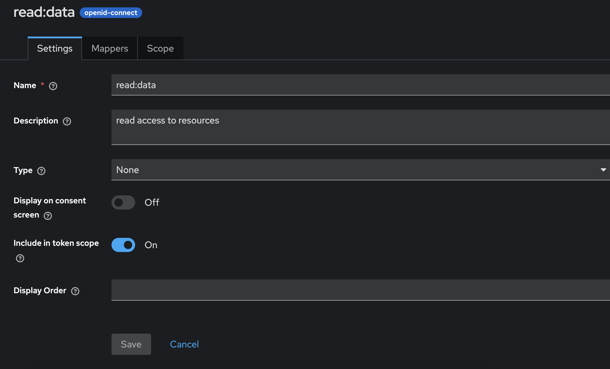

# Security in Spring Based Java Applications

In this paper, we will explore the many options available to secure Spring based Java applications. 

*Note that, this is not a generic paper on Cybersecurity or security practices to secure cloud-based / on-prem applications.*

We will start with familiarizing some of the key terminologies and protocols that are industry-standard in securing critical applications. We would then cement our understanding by implementing a few different use cases.

## What is OAuth?

OAuth (Open Authorization) is an authorization protocol that allows third-party applications to access a user’s resources without sharing the user's credentials or identity.

It lets users grant limited access to their data on one site (e.g. Google) to another site (e.g. StackOverflow) without giving away their username and password.

First version introduced was OAuth 1.0 and the latest improved version is OAuth 2.0.

Concept in Simple Terms:

Everytime we try to login to a new site using an existing FB or google account, OAuth works under the hood to make this possible. What that means is - when we try to access a site like StackOverflow and are asked to login using an existing Google account, we click on a button and are redirected to Google account, where we are then asked to click on an allow button - this is the process of authorizing Google to share a limited set of information with StackOverflow.

Terminologies:

A few fundamental concepts in OAuth are discussed in this section - this would help us in mapping different actors involved in the authorization process.

1. Resource Owner : Owner of the Resource (Data of this person/resource is shared with third party). eg: Person with a Google Account.
2. Client: One who wants access on behalf of RO. e.g: StackOverflow
3. Authentication Server: Server that provides auth tokens. e.g: Google
4. Resource Server: API/Resource that client wants access to, is stored here. e.g: Again, Google.

Same actor can play multiple roles based on the situation.

5. Authorization Grant Types (Flows) are as listed below:

| Grant Type                                           | Use Case                                                 |
| ---------------------------------------------------- | -------------------------------------------------------- |
| Authorization Code                               | Web/mobile apps with user login                          |
| Implicit (deprecated)                            | Was used for browser-based apps (no longer recommended)  |
| Client Credentials                               | Machine-to-machine/server-to-server access               |
| Resource Owner Password Credentials (deprecated) | Username/password directly given to client (discouraged) |
| Device Code                                      | Devices without browsers (TVs, consoles)                 |

In this paper, we will discuss Authorization code flow and client credentials flow.

6. Tokens - Tokens are generated by Authentication Server that is used by clients to access resource at resource server. Two types of tokens are :
    1. Access Token
    2. Refresh Token

7. Different endpoints used by clients to perform auth tasks are:
    1. /authorize – where the user grants access (for code flow)
    2. /token – where tokens are issued
    3. /revoke – (optional) to revoke tokens

## What is OpenID?

We often hear the terms - OAuth and OpenID together and there is a reason for that. Together they provide a complete solution to Authentication/Authorization challenges.

OpenID Connect is a layer on top of OAuth2 that adds authentication — so apps can know who we are. It’s like OAuth2 + ID card.

## What's SAML?

SAML stands for Security Assertion Markup Language.

It’s an open standard used for Single Sign-On (SSO)—especially in enterprise environments.SAML allows one system (identity provider) to tell another system (service provider) that a user has authenticated.

## Providers that support OIDC + OAuth2

1. Okta
2. Keycloak
3. Azure AD
4. Ping Identity
5. Github - GitHub supports OAuth2 only, but it has some custom APIs that can give you user identity. So people use it for login, but it’s not standards-compliant OpenID Connect.It's like a workaround.
6. Google
7. Auth0

## Use Cases
We will explore the following use cases one-by-one. To access the sample code for each case, refer the "Code" section of this paper.

Use Case 1: Service is registered as a Client with google (Auth Server and Resource Server are same - Google)

Use Case 2: Enhance Use Case 1 to add a default route post verification

Use Case 3: Service A accesses Service B securily using KeyCloak(Client and Resource Owner are Same)

Use Case 4: Service A accesses Service B securily, Service B allows only a specific set of scopes

Use Case 5: Use TCP Authentication


**Use Case 1:**

In this use case, Google acts as both the Authorization Server and Resource Server.

Step 1:

To Add Google as Authentication Server and Resource Server, we would need to first create a google cloud project with OAuth2 credentials.

Follow the steps at https://console.cloud.google.com/apis/credentials to create free OAuth2 credentials.

Add sample data in all the fields, for redirect URL - add the following value - http://localhost:8080/login/oauth2/code/google. This is the default redirect URI template provided by Spring App. Note that the final path "google" in the above URL should match the registration id mentioned in application.yml file.(Refer Step 3)

Step 2:

Create a SpringBoot project from [spring](https://start.spring.io/). Add Spring Web, Spring Security and OAuth2 Client as dependency.

Alternatively, add the following dependencies to SpringBoot web project.
```
    <dependency>
			<groupId>org.springframework.boot</groupId>
			<artifactId>spring-boot-starter-oauth2-client</artifactId>
		</dependency>
		<dependency>
			<groupId>org.springframework.boot</groupId>
			<artifactId>spring-boot-starter-security</artifactId>
		</dependency>
```

Step 3:

Add following properties to application.yml file
```
spring:
  security:
    oauth2:
      client:
        registration:
          google:
            client-id: <YOUR_CLIENT_ID>
            client-secret: <YOUR_CLIENT_SECRET>
            scope:
              - openid
              - profile
              - email
        provider:
          google:
            issuer-uri: https://accounts.google.com
```

Step 4: 

Add a default GET endpoint
```
    @GetMapping("/")
    public String home(@AuthenticationPrincipal OidcUser user) {
        return "Hello, " + user.getFullName() + "! Your email is " + user.getEmail();
    }
```

Step 5:

Hit the endpoint - http://localhost:8080


From this use case, let's try to understand the different actors involved in the OAuth process.


| Role                     | Definition                                                       | In Our Example                         |
| ------------------------ | ---------------------------------------------------------------- | ------------------------------------------- |
| Resource Owner      | The person who owns the data or identity.                        | The end user (You)logging in via Google.   |
| Client               | The app that wants to access the user’s data or log the user in. | Our Spring Boot application        |
| Authorization Server | Authenticates the user and gives tokens.                         | Google (accounts.google.com)          |
| Resource Server      | Hosts the user's protected data.                                 | Google (for full name, email) |


**Use Case 2:**

--------------------
*Fun Fact*

SpringBoot by default creates a login page at "/login".This is a page that lists available OAuth2 providers (like Google), with a “Login with Google” button.

If in our Controller class, we add a "/login" endpoint, it will be taken over by internal login page unless it's configured in security chain.

--------------------

In this 2nd use case, we analyze a scenario where the user would first access a base url and then access a "/home" endpoint. We provide access to base url without authentication but any specific endpoint should be accessed post authentication.

This is done by adding relevant endpoints in SecurityFilterChain Bean.

We also add a functionality to this so that everytime our login succeeds we are navigated to "/home" endpoint and not the base endpoint.

```
  @Bean
    public SecurityFilterChain filterChain(HttpSecurity http) throws Exception {
        http
                .authorizeHttpRequests((authz) -> authz
                        .requestMatchers("/").permitAll()
                        .anyRequest().authenticated())
                .oauth2Login(oauth2 -> oauth2
                        .successHandler(successHandler())
                );

        return http.build();
    }

    @Bean
    public AuthenticationSuccessHandler successHandler() {
        SimpleUrlAuthenticationSuccessHandler handler = new SimpleUrlAuthenticationSuccessHandler("/home");
        handler.setAlwaysUseDefaultTargetUrl(true);
        return handler;
    }
```

Note that, both Use Case 1 and Use Case 2 follow "authentication code" authorization flow.

**Use Case 3**

In this use case, we will create two SpringBoot services and add an Authentication Layer between their communication. In real world scenarios, these would be best used when Service A has exposed endpoints and it reaches out to internal services that has access to resources like Salesforce or Financial Database etc.

In scenarios like this, service that initiates communication to the second service acts like a "Client" and "Resource Owner".

Based on OAuth terminology, we would need two more actors to complete the picture - Authorization server and Resource Server.

Resource Server would be the second SpringBoot Application that has access to a confidential resource like Salesforce or DB.

For Authorization Server, out of the many choices available (As listed above at the beginning of this article), we would use KeyCloak in this exercise because it would take us for a ride and help gain concrete understanding of core concepts.

KeyCloak is an OAuth2, OIDC and SAML compliant server.

> -------------------
> -------------------
> ***Setting Up KeyCloak***
>
> We could either install Keycloak in our machine or run it in Docker. In this tutorial, we will be running it in Docker.
>
> We will follow the instructions given in the official document - https://www.keycloak.org/getting-started/getting-started-docker.
>
> These are some key ideas around realm in KeyCloak, curated with help from ChatGPT, 

>| Concept    | What it means in Keycloak |
>| -------- | ------- |
>| Realm  | A space that isolates users, clients, roles, etc.   |
>| Users | Belong to a realm     |
>| Clients    | Apps that are registered inside a realm   |
>| Tokens    | Issued by the realm |

>
> There are different types of Authentication flows that's supported by KeyCloak and based on our need we need to pick the right one for our application. Not to mention this is a bit overwhelming initially but becomes easier as we spend more time around these concepts.
>
> For instance, if we had to pick a flow where the client first retrieves the authorization code and passes it to resource server then we will pick the grant_type as "authorization_code".
>
> 1. Retrieve initial token from keycloak portal

>
> 2. Register the client by making a POST API call. Use the initial token retrieved in Step 1 to set the header.
```
  curl --location 'http://localhost:8080/realms/demorealm/clients-registrations/default' \
--header 'Authorization: Bearer <token>' \
--header 'Content-Type: application/json' \
--data '{"clientId":"demo_client"}'

```
> 3. Copy secret from the response
>
> 4. Update application.yml. Note that, based on the Oauth2 flow we select for our use case, we would need to update the yml file with the right configuration.
>
> Sample data from my experiments is given below(Authorization Code Flow):
```
spring:
  security:
    oauth2:
      client:
        registration:
          keycloak:
            client-id: demo_client
            client-secret: YOUR_CLIENT_SECRET
            provider: keycloak
            authorization-grant-type: authorization_code
            redirect-uri: "{baseUrl}/login/oauth2/code/keycloak"
            scope: openid, profile
        provider:
          keycloak:
            issuer-uri: http://localhost:8080/realms/demo-realm

```
> -----------------------
> -----------------------

In this Use Case, we would pick "OAuth2 Client Credentials Flow" where a client (SpringBoot app) authenticates on its own behalf.

To enable this flow in KeyCloak, we would need to follow these steps:
1. Create a realm (demorealm in this example)

2. Create and register a client for our Client SpringBoot service. (demo_client in our example)

Update Client Settings as shown in the image below,


3. Optionally, create and register another client for our ResourceServer SpringBoot App. This step is not needed for basic JWT authorization so you may as well skip this step for now.

4. For SpringSecurity to find the token endpoint and generate tokens for outgoing API calls, we need to add this in yml file of client app.
```
provider:
    keycloak:
        issuer-uri: http://localhost:8080/realms/demorealm
```
Note that, if we provide token-uri instead of issuer-uri, we are overriding the expected discovery mechanism. If not configured correctly, we would likely get a 405 on this endpoint.

SpringBoot app by default tries to fetch metadata from the "issuer-uri" endpoint by appending ".well-known/openid-configuration" to the base URL. 

All endpoints can be accessed using the link in settings section of keycloak. 

Refer image below,


5. In server app, we would just need to provide the issuer-uri
```
spring:
  security:
    oauth2:
      resourceserver:
        jwt:
          issuer-uri: http://localhost:8080/realms/demorealm
```

6. Ideally, we would want to fetch the token and set it to the header of outgoing API calls in the client application's RestClient/WebClient but for the sake of simplicity, we will return the token from a GET API and manually use that in a postman call made to server API.

Note that, to have free access to client APIs, we bypass the security in config class.

Using Postman or any similar tool, let's fetch the token from Client API


Pass it as a Bearer header token to the resource server API


Delete or tamper the Bearer token and we would find that the call fails with a 401.

We could also inspect the JWT token generated and verify the scope, client details etc.

**Use Case 4**

In the previous use case, we created a client that was assigned a few default scopes by keycloak itself. Token generated for that client was then passed in the header of resource server's API call.

In this use case, we want to only allow API calls with a certain scope to access our resources. This way we can enforce scope level authorization on clients. This way we can also enforce access at a granular level by allowing specific clients to perform authorized actions like read, write etc.

From our previous use case, we would borrow the client and add one additional scope to it. 


Now when we hit the client API, fetch the token generated, head to jwt.io to decode the token, we will notice that an additional "read:data" scope is added. (If we perform the same steps in Use Case 3, we would get this as a scope - "scope": "openid profile email")

There are a few changes that we would need to make in the SpringBoot App that acts as a Resource Server to enforce scope (or role if we wish to do that) based on API patterns.

We can add the patterns in SecurityConfig class or for ease we can do the same in yml file as well.

```
spring:
  security:
    filter:
      chain:
        authorization:
          rules:
            - pattern: /api/**
              access: hasAuthority('SCOPE_read:data')
            - pattern: /**
              access: denyAll
            
    oauth2:
      resourceserver:
        jwt:
          issuer-uri: http://localhost:8080/realms/demorealm
```
We can add as many endpoints as needed and define the scopes and instead of "denyAll", we can add "isAuthenticated()" to allow clients that are not anonymous.

To add more than one authority, we can make use of "hasAnyAuthority(String…​ authorities)" expression instead of the one shown in the example.

Note that, we add "SCOPE_" to denote that anything that follows is the scope we are actualy looking for.

***Testing***

To test our changes, we can add another endpoint that follows a different pattern and observe that "/test/greeting" fails with an authentication error where as "/api/greeting" gives us a response back.

For more Expression-Based Access Control, check Spring docs - https://docs.spring.io/spring-security/reference/6.0/servlet/authorization/expression-based.html.

**Use Case 5**

This use case is significantly different from the previous ones due to the following reasons:

1. Protocols we discussed earlier (OAuth, OIDC etc.) are application-layer protocols that work on top of HTTP. Since we are exploring TCP level security mechanisms, none of the previously discussed protocols can be applied here.

2. Security Mechanisms on HTTP requests are applied per request but TCP layer auth works per connection.

3. TCP level simple authentication alone cannot be relied upon in a zero-trust authentication scenario. But there are alternatives to be considered if the zero-trust apps breathe in a secured environment.

So then why are we exploring this option if it has too many drawbacks?

1. TCP layer communication avoids HTTP overhead like headers, serialization, and session setup, leading to faster and lighter communication.

2. TCP based communication is suitable for faster communication if all the services involved are deployed behind a secured perimeter(same K8s cluster). Think of a scenario where both the client and server are in our control and have no exposed public endpoints/access.

*Case 1: TCP vs HTTP call that responds with a String*

Consider a simple GET API without any Security Headers that sends back a String in response:

```
    @GetMapping("/hello")
    public String hello() {   
        return "hello";
    }
```
We make a call to this API from postman client,


Time taken for the entire transaction is : **183 ms**

Next, let's try to make a TCP call from server to client in a SpringBoot Application - 

We will pass a simple String from Client, Server will validate and respond back to the client.

Client Code::

```
@Component
public class TcpClient {
    private final String SECRET = "mySecretToken";

    @PostConstruct
    public void startClient() {
        new Thread(() -> {
            try (Socket socket = new Socket("localhost", 9999)) {
                BufferedWriter out = new BufferedWriter(new OutputStreamWriter(socket.getOutputStream()));
                BufferedReader in = new BufferedReader(new InputStreamReader(socket.getInputStream()));
                Instant start = Instant.now();
                out.write(SECRET + "\n");
                out.flush();
                String response = in.readLine();
                Duration timeElapsed = Duration.between(start, Instant.now());
                System.out.println("Server Response: " + response + " in "+ timeElapsed.toMillis() + "ms");
            } catch (IOException e) {
                e.printStackTrace();
            }
        }).start();
    }
}
```

Server Code::
```
@Component
public class TCPServer {
    private final String SECRET = "mySecretToken";

    @PostConstruct
    public void startServer() {
        new Thread(() -> {
            try (ServerSocket serverSocket = new ServerSocket(9999)) {
                while (true) {
                    Socket socket = serverSocket.accept();
                    BufferedReader in = new BufferedReader(new InputStreamReader(socket.getInputStream()));
                    BufferedWriter out = new BufferedWriter(new OutputStreamWriter(socket.getOutputStream()));

                    String received = in.readLine();
                    if (SECRET.equals(received)) {
                        out.write("AUTH_OK\n");
                        out.flush();
                    } else {
                        out.write("AUTH_FAILED\n");
                        out.flush();
                        socket.close();
                    }
                }
            } catch (IOException e) {
                e.printStackTrace();
            }
        }).start();
    }

}
```

Response is -> Server Response: AUTH_OK in **2ms**

Note that, this is not an apple to apple comparison between TCP and HTTP. This is one of the easiest way to compare the response time between two protocols but we need to keep in mind that TCP call stayed in-process (Both client and server were in same JVM) whereas HTTP call involved cross-process communication.

*Case 2: Establishing Trust in TCP communications*

TLS as we know is a cryptographic protocol that secures communication over the internet (or any computer network). To further establish trust between the client and server, we can enforce mTLS at the gateway level. 

mTLS is an extension of TLS that stands for mutual TLS, i.e, instead of just server establishing its identity, even client will present its certificates for verification.

Keeping in mind that microservices are typically deployed as containers today, especially in cloud-native environments, we would consider two scenarios :

1. All related services are deployed in same pod 

  There is little gain in adding security mechanisms for communication between services deployed in same pod. Containers in the same pod share the same network and filesystem namespace, they are already highly trusted and co-located.

  In scenarios like these, its better to secure the APIs that are exposed to the outer world but keep the internal communications light and quick using TCP based communications or plain HTTP/gRPC over localhost(developing REST APIs are simpler than TCP based implementation).

2. Services are deployed in muliple pod/nodes

   As in any microservice architecture, basic TLS + OAuth2 + OIDC security established at gateway level acts as a strong defense mechanism.

   Inter-service communications can be secured by:

   1. Adding mTLS to ensure both client and server authenticate each other. This can achieved by using a service-mesh like Istio.
   2. Adding network policies in K8s to add restrictions on pod communications.
   3. Add connection logs for observability and logging.

Note that, TCP based communications are not as popular as HTTP based ones. Primary reason for this is the ease to build and configure HTTP based communication systems for synchronous messaging.

In systems that rely heavily on faster communication like Trading applications, Financial Applications etc. TCP based inter-service communication is more effective but even then one would usually use a protocol or framework like gRPC, Netty etc instead of using raw TCP connections.

Other than Synchornous messagning over TCP Sockets, Systems like Kafka are built on top of TCP protocols. Security in these systems can be established by,

1. Implementing common authentication/authorization mechanisms
2. SSL/TLS encryption for data in transit
3. Custom encryption methods to protect kafka logs on disk

## Code

**Use Case 1** and **Use Case 2**

https://github.com/r7b7/scalable-system-design/tree/spring-security-case-study/code/oauth/security

**Use Case 3** and **Use Case 4**,

1. Client Code : https://github.com/r7b7/scalable-system-design/tree/spring-security-case-study/code/oauth/client
2. Server Code : https://github.com/r7b7/scalable-system-design/tree/spring-security-case-study/code/oauth/server

**Use Case 5**

https://github.com/r7b7/scalable-system-design/tree/spring-security-case-study/code/oauth/tcp 